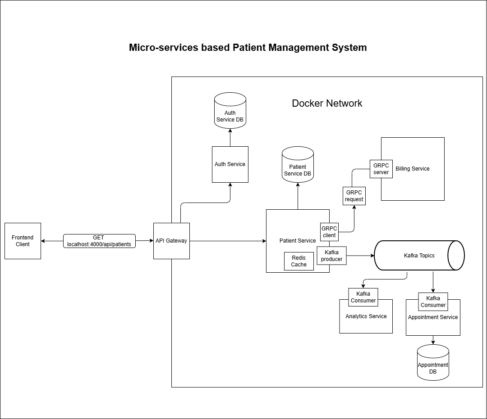

# 🏥 Microservices-Based Patient Management System

A scalable **Patient Management System** built using a **microservices architecture** with Spring Boot.
The system demonstrates synchronous and asynchronous communication patterns, containerization, and observability.

---

## 🚀 Architecture Overview



### 🔹 Key Highlights

* API Gateway as a single entry point for client requests
* Authentication handled via Auth Service
* Patient Service as the core business service
* gRPC-based communication with Billing Service
* Event-driven architecture using Kafka
* Database-per-service design for loose coupling
* Redis caching for performance optimization
* Rate limiting and circuit breakers for resilience and fault tolerance
* Monitoring using Prometheus and Grafana

---

## 🧱 Tech Stack

* **Backend:** Java, Spring Boot
* **Communication:** REST, gRPC
* **Messaging:** Apache Kafka
* **Database:** PostgreSQL
* **Caching:** Redis
* **Containerization:** Docker, Docker Compose
* **Monitoring:** Prometheus, Grafana

---

## 🔄 System Flow

1. Client sends request to API Gateway
2. API Gateway routes request to Auth Service for authentication
3. Authenticated requests are forwarded to Patient Service
4. Patient Service:

   * Communicates synchronously with Billing Service via gRPC
   * Publishes events to Kafka
5. Kafka events are consumed by:

   * Analytics Service
   * Appointment Service
6. Each service manages its own database

---

## 📦 Services

* **API Gateway**
* **Auth Service**
* **Patient Service**
* **Appointment Service**
* **Billing Service**
* **Analytics Service**
* **Kafka**
* **Redis**
* **PostgreSQL (per service)**
* **Prometheus**
* **Grafana**

---

## 🛠️ Setup & Run

### 🔹 Prerequisites

* Docker installed
* Docker Compose installed

---

### ▶️ Run the application

```bash
docker-compose up --build
```

This will:

* Build all services
* Start containers
* Create internal network
* Spin up databases, Kafka, Redis, and monitoring stack

---

### ▶️ Run in background

```bash
docker-compose up --build -d
```

---

### 🛑 Stop the application

```bash
docker-compose down
```

---

## 🌐 Access Points

| Service         | URL                   |
| --------------- | --------------------- |
| API Gateway     | http://localhost:4004 |
| Patient Service | http://localhost:4000 |
| Grafana         | http://localhost:3000 |
| Prometheus      | http://localhost:9090 |

---

## 🛡️ Resilience & Fault Tolerance
* Implemented rate limiting at the API Gateway to control traffic and prevent system overload
* Integrated circuit breaker pattern to handle downstream service failures gracefully
* Ensured system stability by preventing cascading failures across microservices

## 📊 Observability

* **Prometheus** collects metrics from services
* **Grafana** provides dashboards for visualization

---

## 🧠 Key Concepts Demonstrated

* Microservices architecture
* API Gateway pattern
* Event-driven design using Kafka
* Synchronous vs asynchronous communication
* Database per service pattern
* Rate limiting and traffic control
* Circuit breaker pattern for fault tolerance
* Container orchestration using Docker Compose

---

## 🚀 Future Improvements

* Add health checks and retry mechanisms
* Distributed tracing (Zipkin/Jaeger)

---

## 👤 Author

Rahul Menon


